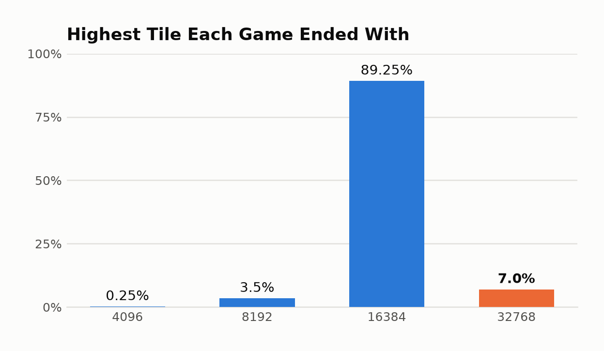

# Optimal 2048 AI Agent Experimentation

A C++20 research project that builds the strongest 2048-playing agent viable for
a standard 8 GB laptop, by measuring game performance of various models and
training techniques. Techniques attempted and tested include hand-written
heuristics, heuristic optimization, temporal-difference training, exact endgame
solving, and a range of search and performance improvements.

---

## Results

### Best Model:

<p align="center">
  
</p>

<p align="center">
  <em>624,164 points · 32,768 tile · 21,960 moves</em><br>
  <sub>Its highest-scoring game, sampled across the full game and slowing down as
  the 32,768 tile is assembled.<br>
  Reproduce with <code>./build-release/watch_agent --seed 30080</code>.</sub>
</p>

| | Result over 400 games |
|---|---:|
| **Mean score** | **362,341** |
| **Best single game** | **624,164** |
| Reaches 16,384 | 96.25% |
| **Reaches 32,768** | **7.00%** |
| Time per move | 2.7 ms |
| Time per game | 40 s |

<picture>
  <source media="(prefers-color-scheme: dark)" srcset="docs/figures/tile-distribution-dark.png">
  
</picture>

### How each approach compared

We implemented different strategies of teaching our agent how to play and tested game performance. Primarily, we used various forms of hand-written heuristic board valuation formulas, and then temporal-difference reinforcement learning.
Every model approach played using a search process looking four moves ahead:

| Approach | Mean score |
|---|---:|
| Hand-written formula, first version | 26,769 |
| Hand-written formula, snake structure | 57,318 |
| Hand-written formula, best version | 109,213 |
| Learned table, 1 million games | 344,399 |
| Learned table, 2 million games | 348,960 |
| **Learned table, 2.5 million games** | **362,341** |

<picture>
  <source media="(prefers-color-scheme: dark)" srcset="docs/figures/progression-dark.png">
  
</picture>

Note: The hand-written rows search exhaustively through all possible branches of the search tree, while the learned rows prune unlikely
branches, so the two groups are not strictly interchangeable — the hand-written
agents received slightly more search per move, meaning the gap understates rather
than flatters the learned networks.

**Full version-by-version record, with parameters and runtimes:
[`experiment_results.md`](experiment_results.md).**

---

## Training Process

The current best agent learns by temporal-difference training over 2.5 million
self-play games. More details can be seen below in the methodology section below.

| | |
|---|---|
| **Training data** | 2.5 million self-play games, roughly 20 billion position updates |
| **Stored model** | 83.9 million learned values, 320 MB |
| **Benchmark games** | Fixed random seeds, so any two versions face identical games |
| **Evaluation seeds** | Held separate from training seeds throughout |
| **Target value** | Expected remaining score from a given board |

---

## Methodology

**Board representation:** Each board is a single 64-bit integer, four bits per
square holding that tile's exponent — a 2 stored as 1, a 4 as 2, and so on.
Sliding a row is then a lookup in a precomputed table indexed by that row's 16
bits, so an entire move costs four table reads rather than any loop over squares.

**Search — expectimax:**  The search alternates two kinds of layers: the agent's own move, where it takes the
best option available, and the game's random tile placement, where it takes the
probability-weighted average over every square the new tile could land in and
both values it could take. Depth counts only the agent's decision layers, not also including the chance layers.

Depth is chosen when the agent *plays*, not when it trains, so one saved model
can be run at any strength — the same weights score 226,325 searching one move
ahead and 334,030 searching at depth three. Because the chance layers branch very widely,
the search also abandons any line whose probability of being reached falls below
a threshold, which is what makes four-move search affordable at a few
milliseconds per move.

**Baseline — hand-written formulas approach:** Manually written heuristic formulas measuring board value, and the search picks the move leading to the best-looking board.
Six versions were built, scoring properties such as the number of empty squares,
whether tiles descend in order along a path, whether similar values sit beside
each other, and whether the largest tile is anchored in a corner. Nothing is actively
learned; all the knowledge is in the formula.

**Model — n-tuple board segmentation approach:** Rather than score the whole board at
once, five overlapping windows of six squares each are laid over it. Every
possible arrangement of tiles visible through a window has its own stored value,
and the board's value is the sum of the five lookups. This makes the model a
large lookup table — 83.9 million values — rather than a formula, so it can
represent patterns nobody thought to write down.

Each window's eight rotations and reflections share one set of values, so a board
and its mirror image are automatically scored the same, and every update teaches
eight equivalent positions at once.

**Training — temporal-difference learning:** The agent plays numerous games against itself.
After each move it compares what it predicted a position was worth against what
it turned out to be worth one move later, and nudges the stored values toward the
truth. No human game knowledge and no recorded games are used. Three refinements
improved performance:

- **Temporal coherence:** Each stored value gets its own learning rate instead of
  sharing one global rate. A value whose past corrections consistently pointed the
  same way is still converging and keeps taking large steps; one whose corrections
  cancel out is oscillating around its answer and gets damped.
- **Backward replay:** A finished game is replayed in reverse when learning, so
  the knowledge that "the game ended here" travels back along the entire game in
  a single pass instead of seeping backward one position per game.
- **Scoring the right board:** The model scores the board *after* the agent's
  move but *before* the random tile appears. Scoring the wrong one of those two
  cost a factor of seven in playing strength.

---

## Validation

Score in 2048 is extremely noisy — one fixed configuration produces games ranging
from roughly 3,000 to over 600,000 points — so much of the engineering effort
went into making measurements trustworthy rather than into the agent itself.

**Sample sizes are derived, not guessed.** Before a comparison runs, the smallest
difference it could detect is calculated from the observed spread. At four-move
search, 60 games resolves only differences above about 9 percent, while 400 games
reaches 3.9 percent. Earlier in this project, eight improvements were tested at 60
games against effects worth 2 to 7 percent and recorded as ties — they were
simply unmeasurable. The comparison tool now reports the effect a run was powered
to detect and refuses to call an underpowered result a tie.

**Selected results are re-confirmed on fresh games.** Choosing the best of several
candidates and then reporting its score on the same games it was chosen on
inflates the result. The current best agent measured +5.5 percent on its selection
games and +2.2 percent on entirely fresh ones; the reported figure is the pooled
+3.8 percent across all 400.

**Correctness is pinned by tests, not by inspection.** Nineteen suites run on
every build. Those prefixed `GATE:` guard properties that would otherwise fail
silently and corrupt results — for instance, that playing games across eight
cores produces bit-for-bit identical scores to playing them on one, and that
adding parallel training left the single-threaded path byte-identical. Builds are
warning-clean and kept that way.

**Every run records its own provenance.** Each benchmark writes a CSV and a JSON
carrying the exact model fingerprint, search settings, seed range, build type and
commit, so no number in this repository is ever separated from the configuration
that produced it.

**Timing is measured without contention.** Running games in parallel leaves scores
identical but makes per-move timings compete for cores, so every published runtime
comes from a single-threaded run.

**Failures are published alongside successes.** Six separate explanations for the
32,768 barrier were tested and refuted, including one that initially appeared to
be a 3.3-times improvement and vanished when re-run on five times the sample.
Retracted conclusions are listed in
[`experiment_results.md`](experiment_results.md) rather than deleted.

---

## Setup

**Requirements.** A C++20 compiler, CMake 3.20 or newer, and Python 3 for the
analysis scripts. No external libraries are needed.

**Step 1 — build the project.** From the repository root:

```sh
cmake -S . -B build-release -DCMAKE_BUILD_TYPE=Release
cmake --build build-release -j4
```

**Step 2 — verify the build.** All nineteen suites should pass before you trust
any number the tools produce:

```sh
ctest --test-dir build-release
```

**Step 3 — get a model to run.** Trained networks are 320 MB each and are
excluded from version control, so `experiments/weights/` is empty on a fresh
clone. Either train one (see below) or use a hand-written evaluator, which needs
no weight file at all:

```sh
./build-release/watch_agent --heuristic H5
```

Run every command from the repository root — model paths are relative to it.

---

## Running the agents

### Watch an agent play

The quickest way to see what a model actually does with a board.

```sh
# See which trained networks are present
./build-release/watch_agent --list

# The best agent, playing its default game
./build-release/watch_agent

# Its highest-scoring game — the one recorded at the top of this page
./build-release/watch_agent --seed 30080

# Skip the long opening; start watching once a 16,384 tile appears
./build-release/watch_agent --from-tile 16384 --delay-ms 150

# An earlier version, for comparison
./build-release/watch_agent --weights experiments/weights/n12_plain_2M.bin

# The best hand-written formula instead of a learned model
./build-release/watch_agent --heuristic H5 --delay-ms 40

# One move at a time, pressing Enter to advance
./build-release/watch_agent --step
```

A full game runs about 15,000 moves, so `--from-tile` is usually what you want:
it plays at full speed until the tile you name appears, then slows to a watchable
rate.

### Benchmark an agent over many games

This is what produces the numbers on this page. `--threads` changes only how fast
a run finishes, never its scores.

```sh
# The best agent, 200 games
./build-release/run_experiment \
  --heuristic N1 --weights experiments/weights/n25_best_2M5.bin \
  --search fixed --depth 4 --probability-cutoff 0.0015 \
  --seeds 30000-30199 --threads 8

# A hand-written evaluator, no weight file needed
./build-release/run_experiment --heuristic H5 \
  --search fixed --depth 4 --seeds 20000-20039 --threads 8

# The same model searching one move ahead, which isolates model quality
# from search strength
./build-release/run_experiment \
  --heuristic N1 --weights experiments/weights/n25_best_2M5.bin \
  --search fixed --depth 1 --seeds 30000-39999 --threads 8
```

### Compare two runs

Reports the difference, its significance, and the smallest effect the runs were
capable of detecting:

```sh
python3 tools/compare_runs.py BASELINE.csv CANDIDATE.csv
python3 tools/compare_runs.py --metric tile:32768 BASELINE.csv CANDIDATE.csv
```

### Train a new model

About three hours for 2.5 million games on eight cores:

```sh
./build-release/train_ntuple --out weights.bin --tuples large \
  --games 2500000 --alpha 0.1 --temporal-coherence --backward-updates \
  --threads 8
```

---

## Repository structure

| Path | Contents |
|---|---|
| `src/core/` | Board representation, move tables, tile spawning |
| `src/search/` | Expectimax search, including the parallel variant |
| `src/evaluation/` | Hand-written evaluators and the learned-network adapter |
| `src/learning/` | Pattern-table network, temporal difference trainer, temporal coherence |
| `src/tablebase/` | Exact endgame solver |
| `src/experiments/` | Benchmark harness, result recording |
| `tools/` | Analysis scripts, the conversion probe, and the live viewer |
| `tests/` | 19 standalone suites; those prefixed `GATE:` are load-bearing |
| `experiments/results/` | Every benchmark run, as CSV and JSON with full provenance |
| `experiments/weights/` | Trained networks (excluded from version control) |
| `docs/` | Design, roadmap, and the full experiment log |

| Document | Read it for |
|---|---|
| [`experiment_results.md`](experiment_results.md) | **Every version, its parameters, and its results** |
| [`docs/32768-investigation.md`](docs/32768-investigation.md) | The 32,768 barrier: every hypothesis and outcome |
| [`docs/experiment-log.md`](docs/experiment-log.md) | The chronological laboratory record |
| [`docs/DESIGN.md`](docs/DESIGN.md) | Architecture and control flow |
| [`docs/ROADMAP.md`](docs/ROADMAP.md) | Current state and open questions |
| [`CLAUDE.md`](CLAUDE.md) | Conventions and invariants — read before editing |

---

## Limitations and future work

**What this project does not solve:** The agent reaches 32,768 in 7 percent of
games and has not breached that cliff reliably. The 65,536 tile — likely the
highest achievable on a 4×4 board — is currently out of reach.

**The barrier is not understood:** Six explanations have been tested and refuted:
skill transfer across tile scales, search depth, search breadth, whole-board
vision, position quality on arrival, and training from late-game positions. The
only lever that moves it is training volume, and that relationship reverses past
2.5 million games.

**The strongest open lead:** The peak sits 500,000 games after a learning-rate
reset, not at any particular training total. If the reset is what produces it
rather than the total, then periodic resets are a repeatable lever rather than a
one-off — cheap to test, and not yet tested.

**Known measurement gaps:** No agent has been benchmarked under the originally
intended 250 millisecond-per-move time budget; every result here is fixed-depth.
Per-move timing distributions are not recorded, only averages.

**Memory:** Configurations reaching higher scores in published work need roughly
15 GB. Doubling the table to 512 MB was measured here and is 34 percent *worse*
at this training scale — more capacity needs proportionally more training.

---

## References:

Inspiration for architecture, structure and methodology was taken from numerous answers from this website: 
<https://stackoverflow.com/questions/22342854/what-is-the-optimal-algorithm-for-the-game-2048>, specifically the answers from 
- nneonneo
- game_difficulty
- SiminSimin

