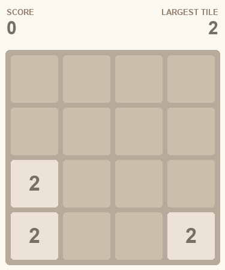
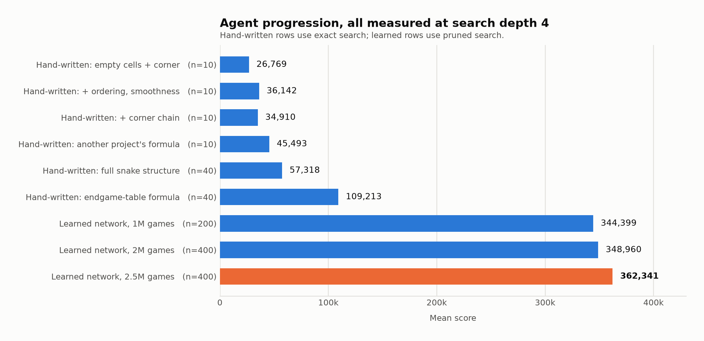
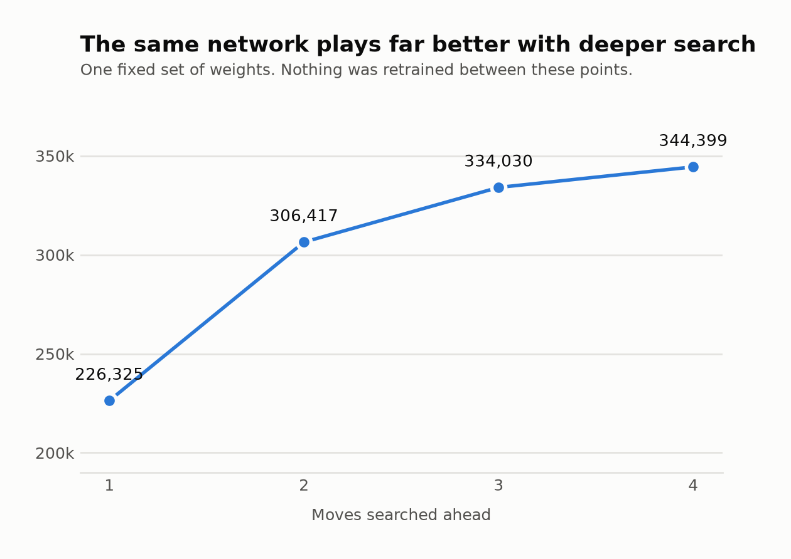
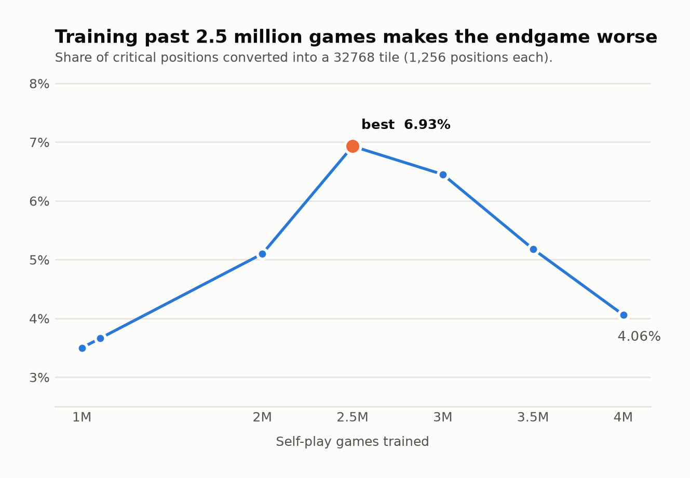

# Experiment Results

The complete record of building this 2048 agent: every version tried, what
changed, how it was configured, and what it scored.

The project ran as four successive approaches, each replacing the last when it
proved stronger, plus a fifth phase that rebuilt the measurement apparatus and
produced the current best agent.

**Current best: a learned pattern-table network trained on 2.5 million self-play
games, searching four moves ahead. Mean score 362,341 over 400 games; reaches the
32768 tile in 7.0 percent of games; best single game 624,164. It takes 2.7
milliseconds per move and 40 seconds per game, measured single-threaded.**

   
  <em>Its best game: 624,164 points, a 32,768 tile, 21,960 moves (seed 30080). 
  Replay it with <code>./build-release/watch_agent --seed 30080</code>.</em>

<picture>
  <source media="(prefers-color-scheme: dark)" srcset="docs/figures/progression-dark.png">
  
</picture>

---

## How to read these numbers

**Every score is an average over many complete games.** A single game of 2048
ranges from roughly 3,000 to over 600,000 points, so an average over a handful of
games carries almost no information. The number of games behind each figure is
always given.

**Search depth is chosen when the agent plays, not when it is trained.** The same
saved network scores 226,325 looking one move ahead and 344,399 looking four
moves ahead. Comparing two versions measured at different depths is meaningless,
so every table below states the depth and compares only within it.

**Score is almost entirely decided by the largest tile reached.** This is why the
tile percentages matter as much as the average:

| Largest tile reached | Average score of those games |
|---|---:|
| 8,192 | 162,320 |
| 16,384 | 355,226 |
| 32,768 | 576,688 |

**How many games are enough.** At search depth four the game-to-game spread is
about 85,000 points on a 350,000 average. That means:

| Games measured | Smallest difference the measurement can detect |
|---:|---:|
| 60 | about 9 percent |
| 200 | about 5 percent |
| 400 | about 3.9 percent |
| 10,000 (at depth one, where games are far cheaper) | about 1.1 percent |

Several conclusions in this project's history were drawn from 60-game runs
against differences of 2 to 7 percent — differences those runs could not
possibly have resolved. Those are marked and corrected in the final section.

**Timing figures are single-threaded.** Running games in parallel leaves scores
identical but makes per-move timings contended and meaningless, so every runtime
below comes from a single-threaded run. Machine: Apple M1, eight cores, 8 GB
memory.

---

## Phase one — hand-written evaluation functions

**The approach.** A person writes a formula that scores how good a board looks.
The agent searches several moves ahead and picks the move leading to the
best-looking board. Nothing is learned; all knowledge is in the formula.

**How the search works.** The agent explores alternating layers: its own move,
then every possible random tile the game could drop, weighted by probability,
then its own move again. Depth counts only the agent's own decision layers.

| Version | What the formula looks at | Mean score | Games | Time per move | Time per game | Reaches 16,384 |
|---|---|---:|---:|---:|---:|---:|
| H0 | empty squares, largest tile near an edge | 26,769 | 10 | 6.3 ms | 9.0 s | 0% |
| H1 | H0 plus tile ordering, similar neighbours, corner preference | 36,142 | 10 | 7.2 ms | 13.2 s | 0% |
| H2 | H1 plus a chain of tiles around the largest | 34,910 | 10 | 7.6 ms | 13.5 s | 0% |
| H3 | full snake structure across the whole board | 57,318 | 40 | 71.8 ms | 193.7 s | 0% |
| H4 | a formula transcribed from another public project | 45,493 | 10 | 4.7 ms | 10.2 s | 0% |
| **H5** | **the formula that came out of phase two** | **109,213** | **40** | **5.0 ms** | **23.6 s** | **0%** |

All measured at search depth four.

**What was learned.** H5 was the surprise: it nearly doubles H3 while running
fourteen times faster per move, and it arrived as a leftover from the endgame
table work that was otherwise abandoned. It remains the strongest hand-written
evaluator by a wide margin.

**An honest caveat.** H0 through H4 rest on ten games each, with heavily
overlapping ranges. Their ordering relative to one another is **not
established** — only H5 and H3 were re-run at forty games. The published ordering
of the middle of that table should be treated as noise.

---

## Phase two — exact endgame tables

**The approach.** Rather than estimate how good a late-game position is, solve it
exactly: enumerate every reachable position with a small number of free squares
and compute the true expected score by working backwards from the end.

**What was built and verified.** A working solver, checked against an independent
brute-force implementation, plus a disk-backed version proven to give identical
answers. Smaller boards (2×4, 3×3, 3×4) were solved perfectly.

**Why it was abandoned — twice, for different reasons.**

1. **Storage.** The two most useful tables would need 250 GB and 1.1 TB. The
   machine has about 21 GB free. The tables that did fit covered situations the
   agent was not yet strong enough to reach.
2. **Relevance.** Once the agent could reach them, this was re-examined. Only
   about 1 percent of late-game moves land in a position those tables cover,
   against a 20 percent threshold set in advance.

**What survived.** The evaluation formula written for the solver became H5, the
best hand-written evaluator in the project.

---

## Phase three — learning from self-play

**The approach.** Replace the hand-written formula with a large lookup table of
tile patterns, and learn the value of every pattern by playing millions of games
against itself.

**How it works.** Five overlapping windows of six squares each are laid over the
board. Every arrangement of tiles visible through a window has its own stored
value, and the board's total value is the sum of the five lookups. Each window's
eight rotations and mirror images share one set of stored values, so every game
teaches eight equivalent positions at once. The table holds 83.9 million values
and occupies 320 MB.

**How it learns.** After each move the agent compares what it predicted against
what actually happened one move later, and nudges the stored values toward the
truth. This is temporal difference learning. Three refinements proved important:

- **Temporal coherence.** Each stored value gets its own learning rate, derived
  from whether its past corrections have pointed consistently in one direction
  (keep moving) or cancelled out (settle down).
- **Backward replay.** A finished game is replayed in reverse when learning, so
  the knowledge that "the game ended here" travels back along the whole game in
  one pass instead of one position per game.
- **Scoring the right kind of board.** The network scores the board *after* the
  agent's move but *before* the random tile appears. Getting this wrong cost a
  factor of seven in playing strength.

### Version progression, all measured at one move ahead

Measured at one move ahead so that training changes are compared without search
masking them. Games per measurement given; the later figures use 10,000 games.

| Version | What changed | Mean score | Games | Reaches 16,384 |
|---|---|---:|---:|---:|
| First learned agent | 4 windows, 1M games | 102,861 | 300 | 0% |
| Temporal coherence added | at 100k games | 90,508 | 300 | 0% |
| Plus backward replay | at 100k games | 111,751 | 300 | 0% |
| Larger window set | 5 windows of 6 squares, 128 MB → 320 MB | 135,043 | 300 | 5% |
| Ten times more training | 1,000,000 games | 228,532 | 10,000 | 54% |
| Twice more training again | 2,000,000 games | 240,366 | 10,000 | 59% |
| **Current best** | **2,500,000 games** | **244,331** | **10,000** | **61%** |

### The effect of searching deeper

The same saved network, nothing retrained, played at increasing depth:

<picture>
  <source media="(prefers-color-scheme: dark)" srcset="docs/figures/search-depth-dark.png">
  
</picture>

| Moves searched ahead | Mean score | Games | Time per move | Time per game | Reaches 16,384 | Reaches 32,768 |
|---:|---:|---:|---:|---:|---:|---:|
| 1 | 226,325 | 200 | 0.001 ms | 0.01 s | 54% | 0% |
| 2 | 306,417 | 200 | 0.035 ms | 0.4 s | 86% | 0% |
| 3 | 334,030 | 200 | 0.862 ms | 10.9 s | 94% | 2% |
| 4 | 344,399 | 200 | 3.5 ms | 46.9 s | 95% | 2% |

The current best agent, being stronger, plays longer games: 2.7 ms per move,
40 seconds per game, 15,072 moves per game, all measured single-threaded.

Searching four moves ahead instead of one is worth more than every training
improvement combined.

Depth five was measured at 346,739, below depth four — but only over 30 games,
which resolves nothing at this spread, and the two runs used different pruning
settings. **That comparison is unresolved, not negative.** It is recorded here
rather than quietly dropped because it is exactly the kind of underpowered result
this project has mistaken for a conclusion before.

### What moved the number, and what did not

| Change | Effect | Evidence |
|---|---:|---|
| Correcting which kind of board is scored (a defect) | 14,262 → 102,861 | 300 games |
| Temporal coherence learning rates | +71% | 300 games |
| Backward replay | +17.9% | 300 games |
| Larger window set (128 MB → 320 MB) | +20.8% | 300 games |
| Correcting the value of a lost position (a defect) | +48% at depth four | same weights |
| Training from 1M to 2M games | +5.2% | 10,000 games |
| Doubling the table again (512 MB) | **−34%** | 10,000 games |
| Whole-board summary feature | **−9.2%** | 10,000 games |
| Snake-structure features | no effect (+0.5%) | 10,000 games |
| Learning from deep-search answers | **−1.7%** | 10,000 games |
| Starting training from late-game positions | **−1.8%** | 10,000 games |
| Splitting the table by game stage | **−19.4%** | 300 games |
| Indexing tiles relative to the largest | **−63%** | 300 games |

**The single most valuable defect fix.** The search asked the network what a
*lost* position was worth instead of using zero. A lost board is full of large
tiles, and the network overvalues those badly, so it scored dying at roughly
137,000 points — the agent was being rewarded for losing. On identical weights:

| Moves ahead | Before the fix | After the fix |
|---:|---:|---:|
| 2 | 184,096 | 306,417 |
| 3 | 219,168 | 334,030 |
| 4 | 42,735 | 356,178 |

---

## Phase four — trying to pass the 32768 tile

The agent reached 16,384 in nearly every game and 32,768 in about 3 percent.
Since score is set by the largest tile, everything now depended on that step.

Eight interventions were tried. **All were measured at 60 games**, which resolves
only differences larger than about 9 percent, while the effects being tested were
2 to 7 percent. They were recorded as ties.

| Attempt | Mean score at depth four (60 games) |
|---|---:|
| Baseline | 356,178 |
| Learning from 748,000 deep-search answers | 341,911 |
| Snake-structure features | 341,790 |
| Splitting the table at 16,384 | 333,535 |
| Starting training from late-game positions | 350,925 |
| Whole-board summary feature | 331,994 |
| Twice the training | 345,858 |
| Blending multi-step returns | 222,296 |

**The conclusion drawn at the time was wrong.** "Eight attempts all tied" was
read as evidence that deeper search compensates for any weakness in the
evaluation, so improving the evaluation was pointless. In fact the benchmark
simply could not see effects that small. Re-measured properly in phase five,
several of these reverse.

---

## Phase five — rebuilding the measurement, and the result it produced

### What was wrong with the measurement

**Sample sizes were far too small.** Every phase-four decision rested on 60
games. Re-running the same comparisons with 10,000 games at one move ahead
changed several answers, including two sign reversals:

| Version | Recorded as | Actually (10,000 games) |
|---|---|---|
| Twice the training | "no gain" | **+5.2 percent** |
| Whole-board summary feature | "+3.8 percent" | **−9.2 percent** |
| Snake-structure features | "worse" | no effect (+0.5 percent) |
| Starting from late-game positions | "tie" | −1.8 percent |
| Doubling the table to 512 MB | "−21 percent" | **−34 percent** (confirmed) |

**Matched game seeds did not help.** The analysis tool claimed that comparing two
agents on identical random seeds "shrinks the error several-fold". The measured
correlation between two agents on the same seed is essentially zero — they
diverge within a few moves, so the same seed is not the same game. Sample size is
the only lever.

**A metric that cannot move cannot judge.** Starting training from late-game
positions was designed to raise the 32,768 rate and was rejected on average score
at one move ahead — where the 32,768 rate is about one game in ten thousand for
every network ever trained. The measurement was structurally incapable of
detecting what the change was for.

### What was built

| Tool | What it does |
|---|---|
| Parallel game running | Plays games across all cores. Scores are bit-for-bit identical at any thread count, verified by a permanent test; measured 3.4 times faster. |
| Parallel training | Trains across all cores with lock-free updates. The single-threaded path is proven bit-for-bit unchanged. Two million games now take three hours instead of a day. |
| Conversion probe | Measures the one decisive quantity directly, described below. |
| Power reporting | The comparison tool now states the smallest difference a run could detect, and refuses to call an underpowered result a tie. |

### Finding where the agent actually fails

Replaying 160 games and recording how far each got produced a result that
contradicted the project's standing explanation. The belief was that the agent
reaches 16,384 and then cannot rebuild the structure underneath it — a hundred-move
task beyond any search.

| How far games got after reaching 16,384 | Games | Share |
|---|---:|---:|
| Second-largest tile only reached 4,096 | 21 | 13.8% |
| **Second-largest tile reached 8,192** | **127** | **83.6%** |
| Completed a second 16,384 | 4 | 2.6% |

**The agent completes the rebuild.** In 84 percent of games it arrives one merge
away from a second 16,384 and then fails to finish. That is a different problem
requiring a different fix.

At that moment the board must hold a perfect descending ladder —
16,384 + 8,192 + 4,096 + … + 2 — filling fourteen of sixteen squares with two
spare. One duplicate or one gap and it does not fit.

### The conversion probe

Because the decisive quantity is a single conditional probability — given a board
holding 16,384 and 8,192, does the agent ever build the second 16,384 — measuring
it through whole games is wasteful. A game at depth four runs about 13,000 moves
and only the last 2,800 test the question.

The probe collects those critical positions once, then replays **only the ending**
from each, with the random tile sequence fixed so every version faces identical
trials. This gives roughly five times more measurements of the decisive quantity
per unit of computer time. Validated against whole games: the probe predicts a
32,768 rate of 4.0 percent where full games measured 4.5 percent.

### Six explanations tested and refuted

| Explanation | How it was tested | Result |
|---|---|---|
| The agent cannot transfer its skill to larger tiles | Compare its move choices on a board against the same board with every tile doubled | Refuted — it picks the same move 76% of the time at every scale |
| It needs to search deeper | Search eight moves ahead on tight boards | Refuted — 24 times the cost, no change |
| It needs to search wider | Thirty-two times more search per move | Refuted — two extra successes in 224 |
| It cannot see the whole board | Test the version with whole-board features | Refuted — no change |
| The position is already lost on arrival | Compare board conditions on arrival against the outcome | Refuted — successes and failures look identical |
| Starting training from late-game positions | Measured on the conversion probe | Refuted — 3.34% against 3.66% for its control |

The fifth of these initially appeared to work: at 224 positions it showed a
3.3-times improvement with a significance value of 0.048. Re-run at 1,256
positions it vanished completely. The apparent effect was its comparison group
drawing 3 successes out of 224 when its true rate is 3.66 percent.

### The result: training longer makes the endgame worse

Measuring conversion at every training checkpoint revealed that the relationship
is not what everyone assumed.

<picture>
  <source media="(prefers-color-scheme: dark)" srcset="docs/figures/training-curve-dark.png">
  
</picture>

| Self-play games trained | Critical positions converted |
|---:|---:|
| 1,000,000 | 3.50% |
| 1,100,000 | 3.66% |
| 2,000,000 | 5.10% |
| **2,500,000** | **6.93%** |
| 3,000,000 | 6.45% |
| 3,500,000 | 5.18% |
| 4,000,000 | 4.06% |

The decline after the peak is unbroken across four consecutive checkpoints, and
the difference between the peak and the end is statistically solid.

**Training longer makes the agent a better general player and a worse
finisher.** At four million games its one-move-ahead score is 1.8 percent higher
than at two million, while its conversion rate is 20 percent lower. The project
was on the verge of training to four million games and would have ended up with a
worse agent while every conventional measurement said it was better.

### The current best agent

Selecting the 2.5-million-game checkpoint and measuring it in full games:

| | Previous best (2M games) | **Current best (2.5M games)** |
|---|---:|---:|
| Mean score | 348,960 | **362,341** |
| Best single game | 585,360 | **624,164** |
| Reaches 16,384 | 93.75% | **96.25%** |
| Reaches 32,768 | 4.00% | **7.00%** |
| Games measured | 400 | 400 |

The improvement is **+3.8 percent**, statistically solid.

**On honesty about that number:** the first measurement, on the same 200 seeds
the checkpoint had been selected on, showed +5.5 percent. Re-run on 200 completely
fresh seeds it showed +2.2 percent. The pooled figure over all 400 games is
+3.8 percent. The larger number was inflated by having chosen this checkpoint as
the best of seven and then measuring it on the same games — the fresh-seed test
exists to catch exactly that, and it did.

---

## Corrections and retractions

This project has retracted conclusions repeatedly. They are listed rather than
quietly removed, because the pattern is the most useful thing in this record.

| Claim | Status | Cause |
|---|---|---|
| "Best agent scores 356,178" | Corrected to 344,399 | 60-game measurement, 3.3 percent optimistic |
| "More training beyond 1M games gains nothing" | **Reversed** | Effect was +5.2 percent; 60 games could not see it |
| "Whole-board features gain 3.8 percent" | **Reversed to −9.2 percent** | Compared a 60-game run against a separate 200-game run |
| "Search masks evaluation improvements" | Withdrawn | The benchmark could not resolve the effects being tested |
| "Matched seeds shrink the error several-fold" | **False** | Measured correlation between agents on a seed is zero |
| "The agent cannot rebuild under a 16,384" | **Reversed** | It completes the rebuild in 84 percent of games |
| "Endgame-seeded training converts 3.3 times better" | **Retracted** | False positive at 224 positions; vanished at 1,256 |
| "Conversion improves with training" | Qualified | True to 2.5M games, then reverses |

---

## What this record cannot tell you

Stated so that nobody infers more from these numbers than they support.

- **Wall-clock cost of most training runs before phase five.** Those logs were
  written to a temporary directory and never committed.
- **The exact window shapes used by published reference networks.** The five- and
  eight-window sets here are this project's own choices; the papers describe
  shapes rather than explicit square lists.
- **Per-move timing distributions.** Only averages are recorded, never the
  worst-case or 95th-percentile move.
- **Any agent under a fixed time budget per move.** Every result here is
  fixed-depth. The originally intended 250-millisecond-per-move regime has never
  been benchmarked with a learned network.
- **Whether the hand-written formulas H0 through H4 are correctly ordered.** Ten
  games each is not enough to rank them.

---

## Where the project stands

**Solved.** Reaching 16,384 — 96 percent of games.

**Not solved.** Reaching 32,768 — 7 percent of games. Six explanations for the
barrier have been tested and refuted. The only intervention that moves it is
training volume, and that relationship peaks and then reverses.

**Best result: 362,341 mean score, 624,164 best game, 32,768 reached in
7.0 percent of games.**

For the detailed laboratory record including every dead end, see
[`docs/experiment-log.md`](docs/experiment-log.md). For the full investigation of
the 32,768 barrier, see
[`docs/32768-investigation.md`](docs/32768-investigation.md).
